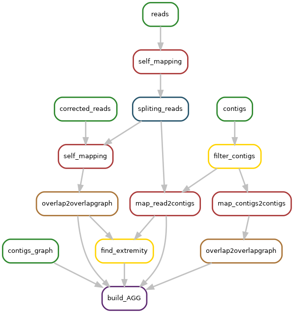

# KNOT

KNOT: Knowledge Network Overlap exTraction is a tool for the investigation of fragmented long read assemblies.

KNOT is described in article **Graph analysis of fragmented long-read bacterial genome assemblies** accepted in [Bioinformatics](https://doi.org/10.1093/bioinformatics/btz219) ([preprint](http://pierre.marijon.fr/dow/graph_analysis_of_fragmented_long-read_bacterial_genome_assemblies.pdf) version)

Give an assembly and a set of reads to KNOT, it will output an information-rich contig graph in CSV format that tells you about adjacencies between contigs.

- [Input](#input)
- [Output](#output)
- [Usage](#usage)
  * [Run knot](#run-knot)
  * [Generate html report on knot result](generate-html-report-on-knot-result)
- [Installation](#installation)
  * [Install with conda](#install-with-conda)
  * [Install without conda](#install-without-conda)
- [Update](#how-to-update-an-already-installed-knot)
  * [Conda installation](#conda-installation)
  * [Non-conda installation](#non-conda-installation)
- [Limitations](#limitations)
- [More details](#more-details)
  * [Pipeline presentation](#pipeline-presentation)
  * [Output description](#output-description)
- [Citation](#citation)

You can find a demo dataset and instructions for using it, in the demo folder of this repository.

## Input

1) long reads (corrected or not) FASTA (no FASTQ allowed)
2) assembly graph (in gfa1) produced by an assembler
3) and contigs (in fasta) from the same assembler

## Output

KNOT outputs an Augmented Assembly Graph (AAG). The AAG is a directed graph where nodes are contigs. An edge is present if two contigs overlap or, if in the original string graph of the reads, 
there exists a path between extremities of both contigs.

Output format is in CSV format with 8 column:
1. tig1: tig name and extremity use in format {tig name}\_{extremity} e.g. tig00000001\_begin
2. read1: read id use to search path for tig1 extremity
3. tig2: other tig name and extremity
4. read2: read id use to search path for tig2 extremity
5. nb_read: nb\_read in path between read1 and read2 (include)
6. nb_base: nb\_base in path between read2 and read2
7. paths: id of read in path found between read1 and read2, separated by ;
8. nbread_contig: number of read assign for each contig in format {tig name}:{nb of read in paths assign to contig}/{nb of read in tig} not\_assign used to read not assigned to a contig, separated by ;.

This output can be used to manually investigate the result of an assembly.
Short paths between contigs are likely true adjacencies. Long paths are likely repeat-induced.

More information about other file generated by knot are avaible in [output description](#output-description)

## Usage

Assume that
- long reads are stored in `raw_reads.fasta`
- contigs are stored in `contigs.fasta`
- contig graph is stored in `contigs.gfa`

### Run knot

Then run KNOT as:

```
knot -r raw_reads.fasta -c contigs.fasta -g contigs.gfa -o {output prefix}
```

knot will run a snakemake pipeline and produce `{output prefix}_AAG.csv` see [output section](#output) for more details, and a directory `{output prefix}_knot` where intermediate file are store.

You can use corrected long reads in place of raw_reads with `-m` option.

Full command line usage:
```
usage: KNOT [-h] -c CONTIGS [-g CONTIGS_GRAPH]
            (-r RAW_READS | -C CORRECT_READS) -o OUTPUT
            [--search-mode {base,node}]
            [--contig-min-length CONTIG_MIN_LENGTH] [--read-type {pb,ont}]
            [--help-all]

optional arguments:
  -h, --help            show this help message and exit
  -c CONTIGS, --contigs CONTIGS
                        fasta file than contains contigs
  -g CONTIGS_GRAPH, --contigs_graph CONTIGS_GRAPH
                        contigs graph
  -r RAW_READS, --raw-reads RAW_READS
                        read used for assembly
  -C CORRECT_READS, --correct-reads CORRECT_READS
                        read used for assembly
  -o OUTPUT, --output OUTPUT
                        output prefix
  --search-mode {base,node}
                        what path search optimize, number of base or number of
                        node
  --contig-min-length CONTIG_MIN_LENGTH
                        contig with size lower this parameter are ignored
  --read-type {pb,ont}  type of input read, default pb
  --help-all            show knot help and snakemake help
```

In addition, snakemake parameters can be add after `--`.

### Generate html report on knot result

You can generate a html report `knot_report.html` on knot information generate previously with this command:
```
knot.analysis -i {output prefix give to knot previously} -c -p -o knot_report.html
```

If `-c` is present, knot.analysis run a path classification, based on path length and composition see [manuscript](#citation) for more details.

If `-p` is present, knot.analysis run a hamilton path search, see [manuscript](#citation) for more details.

## Installation

### Install with conda

Recommended solution (2 command, 5 minutes)

```
wget https://gitlab.inria.fr/pmarijon/knot/raw/master/conda_env.yml
conda env create -f conda_env.yml
```

Activate environement :
```
conda activate knot_env
```

Unactivate environement :
```
conda deactivate
```

### Install without conda

Requirements:

- python >= 3.6
- snakemake >= 5.3
- [yacrd](https://github.com/natir/yacrd) avaible in bioconda or cargo >= 4.1
- [fpa](https://github.com/natir/fpa) avaible in bioconda or cargo >= 0.3

Instruction:

```
pip3 install git+https://gitlab.inria.fr/pmarijon/knot.git 
```

## How to update an already-installed KNOT?

### Conda installation

The recommended way to update this tool is to remove the conda environement and reinstall it :

```
source deactivate knot_env
conda env remove -n knot_env
wget https://gitlab.inria.fr/pmarijon/knot/raw/master/conda_env.yml
conda env create -f conda_env.yml
```

### Non-conda installation

```
pip3 install --upgrade git+https://gitlab.inria.fr/pmarijon/knot.git
```	


## Limitations

This tool has mainly be tested on bacterial genomes only, where it takes 30 minutes to run (in most case). In principle it should also run on larger genomes. But then we expect that the produced augmented assembly graphs will need to be automatically parsed, as their visualization will be more challenging.

## More details
### Pipeline presentation



Legend: 
- input `#2D882D`
- minimap2 `#AA3939`
- fpa `#AA7539`
- yacrd `#27556C`
- output `#5D2971`
- pipeline internal tool `#FFD300`

### Output description

If you run knot with raw reads:
```
{output prefix}_AAG.csv     # AAG result in format describe earlier
{output prefix}_knot        # knot working directory
├── contigs.fasta           # symbolic link to contig sequence provide as input
├── contigs_filtred.fasta   # contig keept in analysis filter on length
├── contigs_filtred.gfa     # contig graph generate by fpa on contig mapping (contigs_filtred.paf)
├── contigs_filtred.paf     # mapping of filtred contig with minimap
├── contigs_graph.gfa       # symbolic link to contig graph provide as input
├── ext_search.csv          # read associated to each contig extremity
├── raw_reads.fasta         # symbolic link to raw read provide as input
├── raw_reads.paf           # self mapping of raw_reads
├── raw_reads_splited.fasta # raw reads without not covered sequence provide by yacrd
├── raw_reads_splited.gfa   # overlap graph generate by fpa on raw_reads_splited self mapping
├── raw_reads_splited.paf   # self mapping of raw_reads_splited
├── raw_reads.yacrd         # yacrd output on raw_reads
└── read2asm.paf            # mapping of read on contigs_filtred
```

If you run knot with corrected reads:
```
{output prefix}_AAG.csv     # AAG result in format describe earlier
{output prefix}_knot        # knot working directory
├── contigs.fasta           # symbolic link to contig sequence provide as input
├── contigs_filtred.fasta   # contig keept in analysis, filter on length
├── contigs_filtred.gfa     # contig graph generate by fpa on contig mapping (contigs_filtred.paf)
├── contigs_filtred.paf     # mapping of filtred contig with minimap
├── contigs_graph.gfa       # symbolic link to raw read provide as input
├── ext_search.csv          # read associated to each contig extremity
├── raw_reads_splited.fasta # symbolic link to corrected read provide as input
├── raw_reads_splited.gfa   # overlap graph generate by fpa on raw_reads_splited self mapping
├── raw_reads_splited.paf   # self mappig of raw_reads_splited
└── read2asm.paf            # mapping of read on contigs_filterd
```
	
## Citation

If you use knot in your research, please cite the following publication:
```
Pierre Marijon, Rayan Chikhi, Jean-Stéphane Varré, Graph analysis of fragmented long-read bacterial genome assemblies, Bioinformatics, btz219, https://doi.org/10.1093/bioinformatics/btz219
```

```
@article{Marijon2019,
  doi = {10.1093/bioinformatics/btz219},
  url = {https://doi.org/10.1093/bioinformatics/btz219},
  year  = {2019},
  month = {mar},
  publisher = {Oxford University Press ({OUP})},
  author = {Pierre Marijon and Rayan Chikhi and Jean-St{\'{e}}phane Varr{\'{e}}},
  editor = {John Hancock},
  title = {Graph analysis of fragmented long-read bacterial genome assemblies},
  journal = {Bioinformatics}
}
```
	
