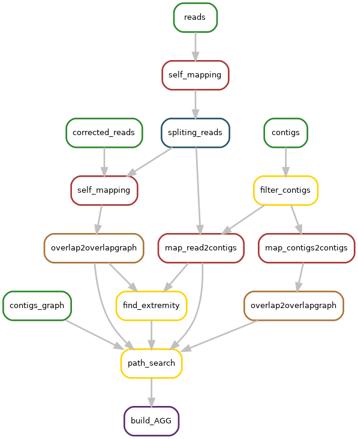

# KNOT

KNOT: Knowledge Network Overlap exTraction is a tool for the investigation of fragmented long read assemblies.

Give an assembly and a set of reads to KNOT, it will output an information-rich contig graph in GFA format that tells you about adjacencies between contigs.

## Input

1) long reads (corrected or not) FASTQ
2) assembly graph (in gfa1) produced by an assembler
3) and contigs (in fasta) from the same assembler

## Output

KNOT outputs an Augmented Assembly Graph (AAG). The AAG is a directed graph where nodes are contigs. An edge is present if two contigs overlap or, if in the original string graph of the reads, 
there exists a path between extremities of both contigs.

Output format (csv):
```
tig1 extremity, read of extremity of tig1, tig2 extremity, read of extremity of tig2, length of path between both extremities, number of reads in path mapped against contigs 
```

This output can be used to manually investigate the result of an assembly.
Short paths between contigs are likely true adjacencies. Long paths are likely repeat-induced.

## Usage

Assume that
- long reads are stored in `raw_reads.fasta`
- contigs are stored in `contigs.fasta`
- contig graph is stored in `contigs.gfa`

Then run KNOT as:

```
knot -i raw_reads.fasta -C contigs.fasta -g contigs.gfa -o {output prefix}
```

knot will run a snakemake pipeline and produce `{output prefix}_AAG.csv` see [output section](#output) for more details, and a directory `{output prefix}_knot` where intermediate file are store.

You can use corrected long reads in place of raw_reads with `-m` option.

Full command line usage:
```

```

In addition, snakemake parameters can be used.

## Installation

### Install with conda

Recommended solution (2 command, 5 minutes)

```
wget https://gitlab.inria.fr/pmarijon/knot/raw/master/conda_env.yml
conda env create -f conda_env.yml
```

Activate environement :
```
source activate knot_env
```

Unactivate environement :
```
source deactivate knot_env
```

### Install without conda

Requirements:

- python >= 3.6
- snakemake >= 5.3
- [yacrd](https://github.com/natir/yacrd) avaible in bioconda or cargo >= 4.1
- [fpa](https://github.com/natir/fpa) avaible in bioconda or cargo >= 0.3

Instruction:

```
pip3 install git+https://gitlab.inria.fr/pmarijon/knot.git 
```


## How to update an already-installed KNOT?

### Conda installation

The recommended way to update this tool is to remove the conda environement and reinstall it :

```
source deactivate knot_env
conda env remove -n knot_env
wget https://gitlab.inria.fr/pmarijon/knot/raw/master/conda_env.yml
conda env create -f conda_env.yml
```

### Non-conda installation

```
pip3 install --upgrade git+https://gitlab.inria.fr/pmarijon/knot.git
```


# Description of the pipeline



Legend: 
- input `#2D882D`
- minimap2 `#AA3939`
- fpa `#AA7539`
- yacrd `#27556C`
- output `#5D2971`
- pipeline internal tool `#FFD300`


# Citation

Please cite this Github URL for now, manuscript is in submission.